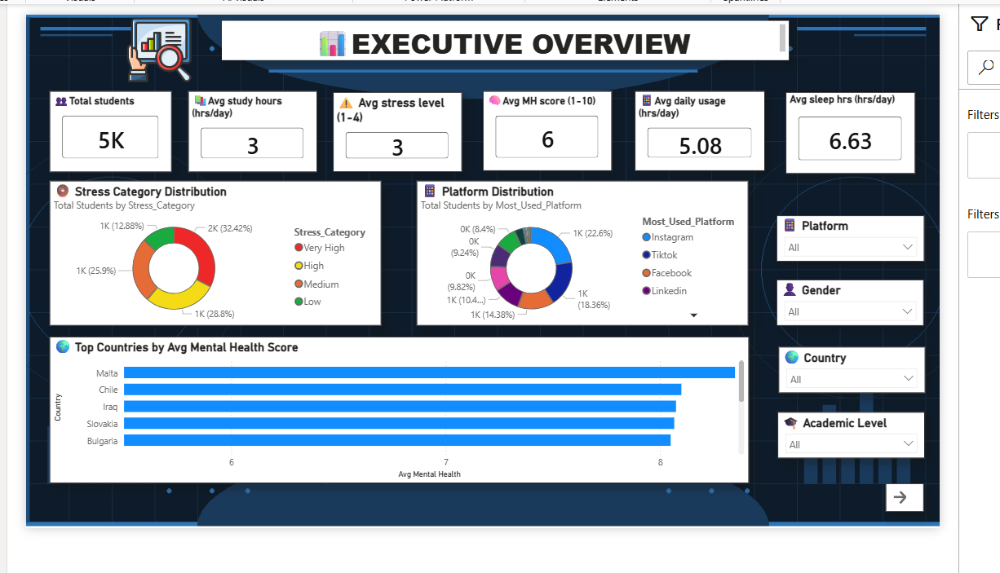
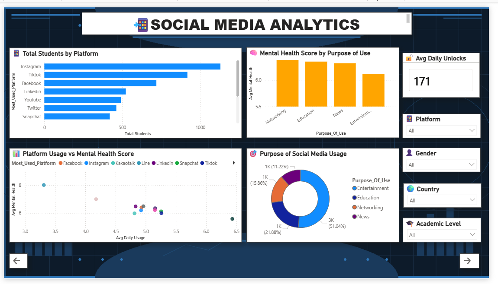
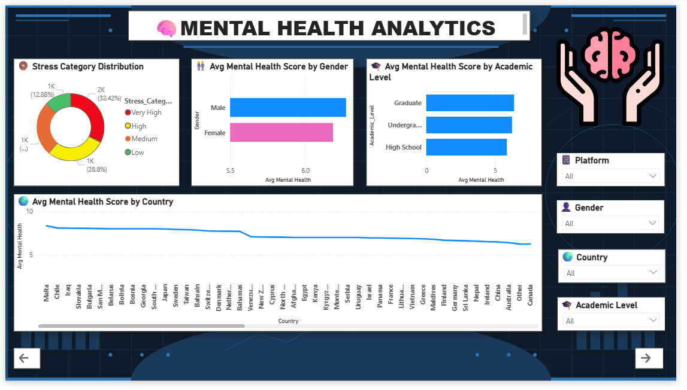
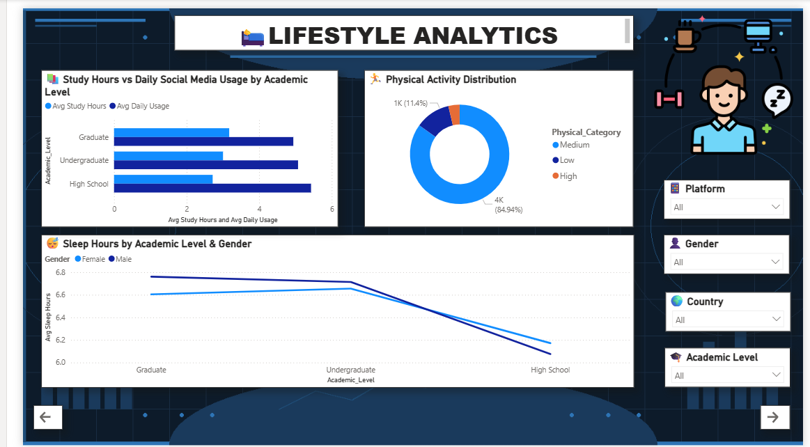

# 🌐 Student Mental Health & Social Media Analytics

> Exploring how digital habits, lifestyle choices, and wellbeing intersect among 5,000 students across 111 countries through interactive Power BI analytics.

---

## Why This Project?

Social media has become a major part of student life. While it offers opportunities for learning, networking, and entertainment, excessive usage can also affect mental wellbeing.

This project investigates patterns between:

- Social media usage
- Mental health indicators
- Sleep habits
- Exercise frequency
- Geographic differences

Using Power BI, the dataset is transformed into an interactive analytical dashboard that allows users to uncover trends and compare student wellbeing across the world.

---

## Project Snapshot

| Metric | Value |
|----------|----------|
| Students Analyzed | 5,000 |
| Countries Covered | 111 |
| Dashboard Pages | 6 |
| Visualization Tool | Power BI |
| Analytics Type | Descriptive & Comparative |

---

## What Questions Does This Dashboard Answer?

### 📱 Social Media

- How much time do students spend on social media?
- Which usage patterns are most common?
- How does screen time vary across regions?

### 🧠 Mental Health

- How are mental health scores distributed?
- What trends appear among highly active users?
- Which groups show stronger wellbeing indicators?

### 🌱 Lifestyle

- Does sleep duration influence mental health?
- How does exercise frequency relate to wellbeing?
- What habits appear among healthier students?

### 🌍 Geographic Insights

- Which countries report stronger mental health outcomes?
- How do student behaviors differ globally?
- What regional patterns emerge from the data?

---

# Dashboard Walkthrough

## 1. Executive Overview

The starting point of the dashboard.

Provides a summary of:
- Student population
- Mental health indicators
- Social media activity
- Country-level distribution



---

## 2. Social Media Analytics

Focuses on usage behavior and engagement patterns.

Key analyses include:
- Usage distribution
- Platform engagement
- Activity trends
- Comparative breakdowns



---

## 3. Mental Health Analytics

Dedicated to understanding wellbeing indicators.

Highlights:
- Mental health score analysis
- Anxiety and stress patterns
- Distribution comparisons
- Student wellbeing trends



---

## 4. Lifestyle Analytics

Examines daily habits that may influence wellbeing.

Focus Areas:
- Sleep duration
- Exercise frequency
- Lifestyle balance
- Habit comparisons



---

## 5. Country Analysis

Provides a global perspective on student wellbeing.

Features:
- Country comparisons
- Ranking analysis
- Geographic trends
- Regional insights


---

## Technical Highlights

### Data Preparation

- Data Cleaning
- Data Transformation
- Quality Validation
- Feature Standardization

### Power BI Features

- Interactive Slicers
- Dynamic Filtering
- Drill-through Navigation
- KPI Cards
- Comparative Visualizations

### Analytical Techniques

- Trend Analysis
- Distribution Analysis
- Country-Level Comparison
- Lifestyle Impact Assessment
- Mental Health Exploration

---

## Skills Demonstrated

### Analytics

✔ Data Exploration  
✔ Pattern Recognition  
✔ Insight Generation  
✔ KPI Design

### Power BI

✔ Dashboard Development  
✔ DAX Calculations  
✔ Data Modeling  
✔ Interactive Reporting

### Business Intelligence

✔ Storytelling with Data  
✔ Executive Reporting  
✔ Decision Support Analytics

---

## Repository Contents

```text
Student-Mental-Health-Social-Media-Analytics
│
├── dashboard_page1.png
├── dashboard_page2.png
├── dashboard_page3.png
├── dashboard_page4.png
├── dashboard_page5.png
├── finalproject.pbix
└── README.md
```

---

## Potential Applications

This dashboard can be useful for:

- Educational Institutions
- Student Support Programs
- Mental Health Researchers
- Data Analytics Learners
- Policymakers studying youth wellbeing

---

## Future Improvements

Planned enhancements include:

- Correlation Analysis Dashboard
- Predictive Mental Health Risk Modeling
- Advanced DAX Metrics
- AI-Generated Insights
- Additional Demographic Analysis

---

## Author

**Lahari**

Computer Science & Engineering Student

Interested in:
- Data Analytics
- Business Intelligence
- Cybersecurity
- AI & Machine Learning

---

*"Turning student data into actionable insights through analytics and visualization."*
